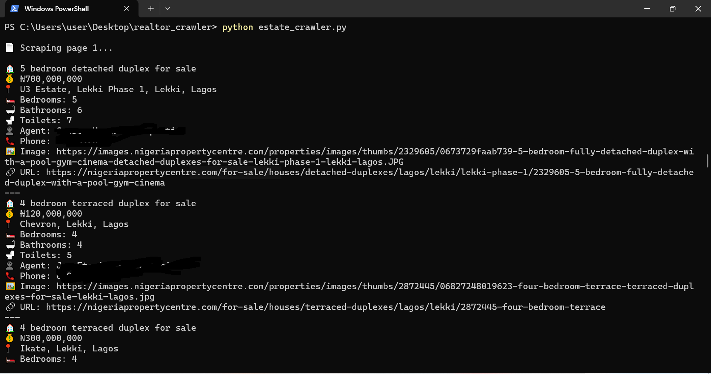

# 🏠 **real-estate-scraper-nigeria-property-centre** 🇳🇬

A focused Playwright-based web scraper that collects property listings from Nigeria Property Centre, specifically houses for sale in Lagos.

It extracts essential details — title, price, location, property specs, agent info, and more — and saves them in clean, portable formats for analysis or further use.

⸻

🔍 What It Does
   •  Navigates through multiple pages of listings automatically  
   •  Extracts:  
   •  Title  
   •  Price  
   •  Location  
   •  Number of bedrooms, bathrooms, and toilets  
   •  Agent name and phone number  
   •  Image URL  
   •  Listing URL  
   •  Saves data to both JSON and CSV  
   •  Configurable for scraping more pages or running headlessly

⸻

⚙️ How to Run  
1. Clone the repository:

```shell
git clone https://github.com/your-username/real-estate-scraper-nigeria-property-centre.git
cd real-estate-scraper-nigeria-property-centre
````

2. Install dependencies:

```shell
pip install playwright
playwright install
```

3. Run the script:

```shell
python estate_crawler.py
```

4. View your data:
   • `properties.json`
   • `properties.csv`

⸻

🧩 Customization
•  Set the number of pages to scrape by adjusting the `max_pages` variable in `scraper.py`.
•  Change `headless=False` to `headless=True` to run the browser silently.

⸻

📁 Use Case

This project is part of my web scraping portfolio. It shows how automation can simplify real estate data collection and structure it for insights, dashboards, or further tools.

⸻

🧾 Example Output

Here’s a sample of the data the scraper collects. Personal details like agent names and phone numbers have been removed to protect privacy:

```json
{
  "title": "5 bedroom semi-detached duplex for sale",
  "price": "₦125,000,000",
  "location": "Amity Estate, Sangotedo, Ajah, Lagos",
  "bedrooms": "5",
  "bathrooms": "5",
  "toilets": "6",
  "agent_name": "[REDACTED]",
  "phone": "[REDACTED]",
  "image_url": "https://images.nigeriapropertycentre.com/properties/images/thumbs/2595961/067ad27322b20a-luxury-5-bedrooms-semi-detached-duplex-semi-detached-duplexes-for-sale-sangotedo-ajah-lagos.jpg",
  "url": "https://nigeriapropertycentre.com/for-sale/houses/semi-detached-duplexes/lagos/ajah/sangotedo/2595961-luxury-5-bedrooms-semi-detached-duplex"
}
```

📌 This is a sanitized snapshot. Actual output files are generated when the script runs.

⸻

📸 **Running Snapshot**

Here’s a snapshot of the scraper running in the terminal:



⸻

🙋‍♂️ Want to Collaborate or Hire?

**Abass Owolabi**
GitHub: [@Abassowolabi](https://github.com/Abassowolabi)
Email: [abassowolabi091021@gmail.com](mailto:abassowolabi091021@gmail.com)


